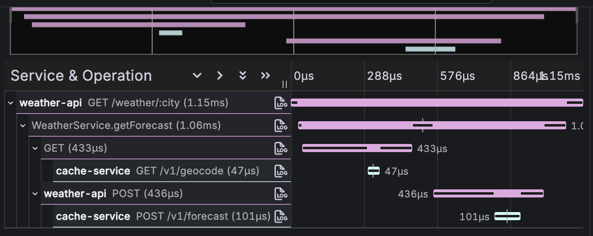

# Dart OTel Demo

A reference implementation of well-instrumented Dart server applications and
CLIs using the [Dartastic OpenTelemetry SDK][sdk]. Built as the working example
for the `blog.dart.dev` post on observability for Dart and Flutter.

> **Companion blog post:** _coming soon — link to be added when published on `blog.dart.dev`._

**Status.** Shipped and runnable end-to-end. `tool/stack.sh up`
brings up two services + Grafana LGTM + bundled dashboards in one
command. The [Cloud Run path](./deploy/cloudrun/README.md) and
[Cloud Functions Gen 2 path](./deploy/functions/README.md) both
ship deploy scripts for `weather-api` and `cache-service` with
production-grade IAM-locked service-to-service auth, and recommend
Google Cloud Operations (Cloud Trace + Cloud Logging + Cloud
Monitoring) as the telemetry backend. For the design rationale
and the choices behind these patterns, see [DESIGN.md](./DESIGN.md);
this README is the practical documentation of what's shipped.

## What this demonstrates



- Distributed tracing across a CLI client, two Dart HTTP services, and an
  external API — one trace ID flowing through every hop, four levels deep.
- The standard OTel HTTP server semantic conventions: a
  `http.server.request.duration` histogram with bounded labels, plus
  full HTTP semconv attributes on every server span.
- Production-grade OTel patterns: `BatchSpanProcessor` everywhere,
  `SIGTERM`-driven graceful shutdown, route-template span names for
  bounded cardinality, propagated W3C Trace Context and Baggage,
  parent-based sampling.
- A `weather_client` SDK that implements `WeatherProvider` over HTTP —
  the same package is consumed by both `weather_api` (calling
  `cache_service`) and `weather_cli` (calling `weather_api`),
  demonstrating the symmetry between the demo's services and a
  caller-side library.
- A **Flutter web/wasm client** ([`apps/weather_flutter`](./apps/weather_flutter/README.md))
  that originates the trace from a user tap. Dartastic SDK
  `1.1.0-beta.3` + API `1.0.0-beta.5` run unchanged in the browser.
  Wire format swaps on `kDebugMode`: **debug builds use OTLP/HTTP-
  JSON** (`OtlpHttpProtocol.httpJson`, added in SDK beta.3) on
  every signal so OTLP payloads are readable JSON in DevTools;
  **release builds use protobuf** so end users don't see telemetry
  contents in their browser. Span timing is
  sub-millisecond via the API's `WebTimeProvider` (auto-selected at
  compile time on web targets — routes through `performance.now() +
  timeOrigin` for ~5–100µs precision instead of `Date.now()`'s
  millisecond floor). The same `InstrumentedHttpClient` used server-side
  propagates W3C trace context across the HTTP boundary so the
  Flutter span is the root of a five-level trace tree. A
  polished Flutter integration with navigator-observer spans,
  route templates, error-boundary widgets, and frame metrics is
  on the way as [Flutterrific OpenTelemetry Pro][flutterrific] —
  the Flutter app here uses the SDK directly so the reader can
  see exactly which line does what.
- A swarm runner (`load/run_swarm.sh`) that spawns N parallel CLI
  invocations and force-flushes the SDK before exit, plus a bundled
  Grafana dashboard whose latency heatmap shows the bimodal pattern
  (cache hits vs Open-Meteo round trips) that pops out at any
  meaningful traffic volume.
- A testing strategy that uses the **real** OTel SDK against an
  in-memory exporter — no mocking the SDK. See
  [Testing strategy](#testing-strategy).

## Quick start

```sh
# Bring up weather_api + cache_service + Grafana LGTM in one command:
tool/stack.sh up

# In another shell, drive a request through the stack:
curl -s 'http://localhost:8080/weather/Toulouse?days=3' | jq .

# Or generate enough volume to make the dashboards interesting:
load/run_swarm.sh --total 500 --parallel 25

# Open Grafana → Dashboards → Dart OTel Demo → Service Overview.
# The latency heatmap shows the bimodal cache pattern after a swarm.
open http://localhost:3000          # admin / admin
```

Full walkthrough — what's running, what to look for in the trace tree,
how to drive it from the CLI, how to tear it down — in
[deploy/local/README.md](./deploy/local/README.md).

## System architecture

```
                ┌──────────────────────────────────────┐
                │  external — open-meteo.com           │
                └──────────────▲───────────────────────┘
                               │ http (W3C trace context)
                ┌──────────────┴───────────────────────┐
                │  cache_service                       │
                │  in-memory cache; on miss, fetches   │
                │  upstream and writes back            │
                └──────────────▲───────────────────────┘
                               │ http (W3C + baggage)
                ┌──────────────┴───────────────────────┐
                │  weather_api                         │
                │  public front door: validation,      │
                │  request shaping, response format    │
                └──────────────▲───────────────────────┘
                               │ http (W3C + baggage)
                ┌──────────────┴───────────────────────┐
                │  weather_cli   (instances 1..N,      │
                │                 swarmable)           │
                └──────────────────────────────────────┘
```

A single trace identifier flows from the CLI through both internal services
and into the external Open-Meteo call. Baggage entries (`cli.run_id`,
`cli.session_id`, `request_id`, `tenant`) flow with it and become searchable
attributes on every span via the `BaggageSpanProcessor`.

## Package layout

Every package depends on the Dartastic OpenTelemetry **SDK**
(`dartastic_opentelemetry`). Library packages do not call `OTel.initialize()` —
that's exclusively an application-layer concern and lives in the service or
app entrypoint.

```
packages/
  weather_core         domain models, business logic, instrumented; no init
  weather_http_kit     shelf middleware + instrumented http.Client; no init
  weather_client       Dart HTTP client SDK for the v1 API; no init
  weather_otel         app-side bootstrap (init, SIGTERM wiring, gated admin endpoint)
services/
  weather_api          public front door
  cache_service        cache + upstream fetcher
apps/
  weather_cli          instrumented caller, swarmable
  weather_flutter      Flutter web/wasm client; trace originates in a user tap
load/
  run_swarm.sh         spawns N CLI instances for throughput demos
dashboards/
  grafana/             pre-built Grafana dashboard JSON, auto-loaded into the local stack
deploy/
  local/               docker-compose for app + Grafana LGTM
  cloudrun/            Cloud Run deploy scripts + env YAML; IAM-locked cache-service
  functions/           Cloud Functions Gen 2 deploy scripts + env YAML; same shape as cloudrun
```

## What's shipped

The comprehensive list — every pattern, package, dashboard, and deployment
target you can read or copy from this repo today.

### Distributed tracing end-to-end

- **Trace tree end-to-end.** `weather_cli → weather_api →
  cache_service → open-meteo`. Single trace_id, four levels deep.
  Provider-level spans (`open-meteo geocode`) nest as parents of
  transport-level client spans (`GET`) so each hop carries both
  business semantics and HTTP semantics.
- **W3C Trace Context propagation** on every HTTP boundary, inbound
  and outbound. Implemented once in `weather_http_kit` and reused.
- **W3C Baggage propagation** on every boundary too — `baggage`
  header extracted to `Context.current` so handler code can read it
  via `Baggage.fromContext(Context.current)`.
- **`BaggageSpanProcessor` wired by default in `weather_otel`'s
  bootstrap.** Every entry in `Context.current.baggage` is copied
  onto each starting span as a string attribute. Combined with the
  W3C Baggage propagator (which carries baggage entries as a
  `baggage` header on every outbound HTTP request), a baggage entry
  set once at the CLI's entry point appears as a span attribute on
  every span across the trace tree — `weather-cli`, `weather-api`,
  `cache-service`, and the open-meteo client spans nested under
  cache-service. Searchable in any backend without per-handler
  enrichment.
- **Concrete baggage entries** emitted by `weather_cli`:
  `cli.run_id` (UUID v4 per process invocation; finds all spans
  for one CLI run with one search) and `cli.session_id` (read
  from the `CLI_SESSION_ID` env var; the swarm script sets one
  session id for an entire batch so every CLI in one swarm
  shares it). Both are bounded-cardinality identifiers — safe
  for the BaggageSpanProcessor to copy onto every span.

### Production-grade SDK wiring

- **`BatchSpanProcessor` everywhere in production paths.**
  `SimpleSpanProcessor` only in tests. The bootstrap reads SDK
  defaults; explicit overrides are an `OTEL_*` env-var concern.
- **`ParentBasedSampler(TraceIdRatioSampler(...))`** wired in the
  bootstrap. 100% sampling default for the demo, env-overridable.
- **SIGTERM / SIGINT graceful shutdown.**
  `weather_otel.attachToProcessLifecycle()` installs handlers that
  forceFlush and shutdown the SDK before exit. Documented for the
  Cloud Run 10-second grace window.
- **`recordException` + `setStatus(Error)`** on every caught
  exception in instrumented code. ~13 sites across the codebase.
- **Zone-based uncaught-error capture.** Every Dart entry point
  (`weather_cli`, `weather_api`, `cache_service`) wraps its `main`
  in `runWithOtelErrorHandlers` (from `weather_otel`), which
  installs a `runZonedGuarded` handler that records the exception
  on the active span and logs it through `package:logging` — the
  OTel-bridged log pipeline picks it up automatically. The Flutter
  client uses the full three-handler pattern: `runZonedGuarded` +
  `FlutterError.onError` + `PlatformDispatcher.instance.onError`,
  each one feeding the same `_recordOnSpan` helper so framework,
  platform, and async-escape errors are all visible in the
  backend.
- **Error categorization across HTTP boundaries.**
  `WeatherProviderException` ↔ HTTP status mapping is symmetric
  between weather_api (`httpStatusForProviderError`) and
  weather_client (`_exceptionForStatus`); errors round-trip cleanly
  through any number of hops.

### HTTP semconv metrics

- **`http.server.request.duration` histogram** emitted by the shelf
  middleware with a deliberately low-cardinality label set
  (method, route TEMPLATE, status_code, scheme), pinned by a test
  that catches accidental high-cardinality additions. The metric
  name, instrument kind, and unit come from API beta.6's spec-
  derived `HttpMetric` enum so typos in any of the three are
  compile errors:

  ```dart
  const httpServerDuration = HttpMetric.serverRequestDuration;
  meter.createHistogram<double>(
    name: httpServerDuration.name,   // 'http.server.request.duration'
    unit: httpServerDuration.unit,   // 's'
    description: '…',
  );
  ```

  Attribute maps are built with API beta.6's typed-enum + dot-
  shorthand pattern:

  ```dart
  OTel.attributesFromSemanticMap({
    ...<Http, Object>{
      .requestMethod:      request.method,
      .httpRoute:          route ?? 'unknown',
      .responseStatusCode: statusCode,
    },
    Url.urlScheme: request.requestedUri.scheme,
  });
  ```

  Inner `<Http, Object>` and `<Url, Object>` spreads carry the
  enum-prefix as the map's static type, which is what makes the
  `.requestMethod` shorthand resolve. Different enum families mix
  in the same outer literal. For a single-family map, prefer
  `OTel.attributesOf<Http>({.responseStatusCode: 200, ...})` —
  same shorthand, no spread.
- **In-flight requests gauge** (`http.server.active_requests`) in
  `weather_http_kit`'s shelf middleware. UpDownCounter
  incremented on request start, decremented on request end (in
  `finally`, so handlers that throw still decrement). Same
  bounded label set as the duration histogram minus
  `http.response.status_code` (the request is in flight, no
  status yet) — `http.request.method`, `http.route`,
  `url.scheme` only. Pinned by a cardinality test plus a
  return-to-baseline test that catches inc/dec attribute
  mismatches before they leak series in production.

### Domain metrics

- **Cache attribution on spans.** `cache_service` annotates the
  active server span with `weather.cache.namespace`,
  `weather.cache.outcome` (hit / miss / expired), and
  `weather.cache.size`, plus a `cache.{outcome}` event.
- **Cache hit/miss/expired counter** in `cache_service`.
  `weather.cache.lookups` is a counter incremented per cache
  lookup, attributed by `weather.cache.namespace` (forecast |
  geocode) and `weather.cache.outcome` (hit | miss | expired).
  Cardinality is bounded forever — eight series at most. Promoted
  from a span attribute (which is per-trace and only useful for
  individual debugging) to a proper metric so backends can chart
  hit ratio over time and alert on miss-rate spikes. The
  cardinality discipline is pinned by a test in
  `services/cache_service/test/handler_test.dart` —
  introducing a high-cardinality attribute on this metric (a
  query string, a request id) makes the test fail.
- **Upstream dependency-health + cost counter**
  (`weather.upstream.requests`) on `OpenMeteoProvider`. One
  counter answers two questions: dependency health (success /
  total over a rolling window, sliced by `error.kind`) and
  upstream-call cost (count × per-call price). Attributes:
  `weather.provider`, `weather.operation`, `weather.outcome`,
  `weather.error.kind` (only when outcome=error). ~80 series
  upper bound. Cardinality is pinned by a test that fails the
  moment a high-cardinality attribute (city name, query string,
  request id) is added.

### FaaS / Cloud Functions support

- **`faas.coldstart` and `faas.execution` per-invocation
  attributes** on every server span emitted by `weather_http_kit`'s
  `otelMiddleware`. `faas.coldstart` is a boolean — `true` on the
  first request a process handles, `false` thereafter — set via a
  process-global latch that flips on first observation.
  `faas.execution` is read from the `Function-Execution-Id`
  inbound header (Cloud Functions Gen 2 sets this on every
  invocation) and forwarded as-is so trace data correlates with
  the platform's own logs and metrics. Both are span attributes
  only, never metric labels (the execution id is high-cardinality
  by design).
- **`faas.coldstart.duration` histogram** alongside the
  `http.server.request.duration` histogram, recorded once per
  process — on the first request the instance handles. Same
  low-cardinality label set as the duration histogram (method,
  route, status_code, scheme) so dashboards can graph cold-start
  cost distribution side-by-side with the general-purpose latency
  distribution without folding `faas.coldstart` in as a label
  (which would double the duration histogram's series count for
  warm-path values that are always `false`).

### Logs

- **OTel logs SDK integration via a `package:logging` bridge.**
  `weather_otel`'s bootstrap forwards every `package:logging`
  record through the OTel logs SDK so entries flow over OTLP
  with the active span's trace_id and span_id attached, while
  the application's own stdout listener keeps printing locally
  (additive, not a replacement). Each `Logger` becomes its own
  OTel instrumentation scope by name. The demo ships its own
  ~40-line bridge in `package_logging_bridge.dart` — readable,
  enough for the demo. A production-grade `package:logging`
  bridge ships in `dartastic_opentelemetry_logging` as part of
  Dartastic.io Pro, alongside other higher-quality telemetry
  packages — drop it in instead when production polish matters.

### Backend selection

- **Backend selection by env var, no code change.** The
  Dartastic SDK reads the standard `OTEL_TRACES_EXPORTER`
  (`otlp` | `console` | `none`) and `OTEL_EXPORTER_OTLP_ENDPOINT`
  variables on its own — the bootstrap doesn't add any custom
  switching. Five concrete backends documented today: Grafana
  LGTM (local stack), `console` / stdout (debugging and CI),
  Google Cloud Operations (Cloud Run target — Cloud Trace +
  Cloud Logging + Cloud Monitoring), Dartastic Cloud (when
  online), and any other OTLP-compatible backend (Honeycomb, a
  self-hosted collector, …). See
  [Selecting a telemetry backend](#selecting-a-telemetry-backend)
  below.

### Local development

- **Local stack** (`deploy/local/`): `docker compose` brings up
  `weather_api` + `cache_service` + Grafana LGTM + bundled
  dashboards in one command. Single-binary stack with auto-loaded
  dashboards under "Dart OTel Demo" in Grafana.
- **Swarm script** (`load/run_swarm.sh`): N parallel CLI
  invocations, post-run flush via the demo admin endpoints
  (`POST /flush` on loopback-bound 8081 / 8091, only when
  `OTEL_DEMO_MODE=true`).
- **Bundled Grafana dashboard** in `dashboards/grafana/`,
  auto-loaded into the local stack's Grafana container.

### Browser support (Flutter web + wasm)

- **Flutter web/wasm client** (`apps/weather_flutter`). The simplest
  possible Flutter screen — text field for the city, button to
  fetch, card showing current conditions and a 3-day forecast.
  Wires the Dartastic OpenTelemetry SDK directly: explicit OTLP
  HTTP exporters for traces, metrics, and logs (JSON wire format
  in debug builds, protobuf in release builds — selected via
  `kDebugMode`); a manually-started root span around the user's
  tap; and `InstrumentedHttpClient` for trace-context propagation
  on every outbound request. Demonstrates that SDK 1.1.0-beta.3 + API
  1.0.0-beta.5 work in dart2js AND dart2wasm — five-level trace
  tree from the tap through to Open-Meteo, with payloads readable
  in DevTools. **Sub-millisecond span timing** on web comes for
  free: the API's `WebTimeProvider` is selected at compile time
  via `dart.library.js_interop` and routes timestamps through
  `performance.now() + timeOrigin` instead of `Date.now()`'s
  millisecond floor — no opt-in needed. **Flutterrific
  OpenTelemetry Pro** (coming as a Dartastic.io Pro package)
  will replace the manual SDK wiring with navigator-observer
  spans, route-template extraction, error-boundary widgets, and
  frame-timing metrics; the demo uses the SDK directly so
  readers see the mechanics.
- **Permissive CORS on `weather_api`.** A small middleware
  (`_corsMiddleware` in `services/weather_api/lib/src/router.dart`)
  allows the browser to send the `traceparent`, `tracestate`, and
  `baggage` headers the W3C propagators need. Production code
  should narrow `access-control-allow-origin` to a specific origin;
  the demo uses `*` for reference simplicity.
- **Web-safe `weather_client`.** The package is conditionally-
  imported web-safe — `dart:io`'s `SocketException` is split via a
  stub for browser builds (`packages/weather_client/lib/src/_compat/`)
  so the client SDK builds for both io and web targets unchanged.

### Production deployment

- **Cloud Run deployment** (`deploy/cloudrun/`).
  `weather-api` and `cache-service` deploy via the bundled
  `gcloud-deploy-*.sh` scripts. Production-grade auth:
  `cache-service` is `--no-allow-unauthenticated`; weather-api's
  outbound HTTP path attaches a Cloud Run ID token from the GCE
  metadata server (no-op locally, active on Cloud Run) on every
  call. Telemetry destination is OTLP-to-Cloud-Operations by
  default — Cloud Trace / Cloud Logging / Cloud Monitoring all
  accept OTLP natively.
- **Cloud Functions Gen 2 deployment** (`deploy/functions/`).
  Mirror layout to `deploy/cloudrun/`. Same Dockerfiles, same
  `WeatherClient.tokenProvider` wiring (Functions Gen 2 IS Cloud
  Run under the hood — `K_SERVICE` is set, the metadata server is
  reachable, SIGTERM is delivered the same way), with overrides in
  the env YAML for `cloud.platform=gcp_cloud_functions` and
  `faas.name` so dashboards can split Functions out from Cloud
  Run.

### Testing pattern

- **Testing pattern** with `InMemorySpanExporter` and an
  on-demand metric reader. Every package has a ~50-line harness
  designed to be lifted into a reader's project unchanged. See
  [Testing strategy](#testing-strategy) for the full pattern.

## Deployment matrix

The same Dart code ships to three runtimes. The runtime is selected by a
Dockerfile or a Functions entry shim. The telemetry destination is selected
entirely by `OTEL_*` environment variables — there is **no code change
between backends.**

| Runtime                         | weather_api | cache_service | Notes                              |
|---------------------------------|-------------|---------------|------------------------------------|
| Local Docker Compose            | container   | container     | Bundled with Grafana LGTM stack    |
| Google Cloud Run                | service     | service       | Service-to-service via internal URL|
| Dart Cloud Functions (Gen 2)    | function    | function      | Function-to-function via HTTPS     |

## OpenTelemetry patterns

The patterns the demo establishes — what to copy, why, and where each
pattern lives in the codebase.

**Trace context propagation.** W3C Trace Context (`traceparent`,
`tracestate`) on every HTTP boundary, inbound and outbound.
Implemented once in `weather_http_kit` middleware and the instrumented
HTTP client; reused by every service and the CLI.

**Baggage.** W3C Baggage propagation alongside trace context. The
bootstrap registers a `BaggageSpanProcessor` so baggage entries become
span attributes automatically — searchable in any backend without
manual enrichment. Demo entries: `cli.run_id`, `cli.session_id`,
`request_id`, `tenant`.

**Sampling.** Default is `ParentBasedSampler(TraceIdRatioSampler(arg))`
so upstream sampling decisions are honored. The demo ships at 100%
sampling (`OTEL_TRACES_SAMPLER_ARG=1.0`); production guidance for
tuning is in the deploy READMEs.

**Span processor.** `BatchSpanProcessor` everywhere. Production-grade
defaults: `scheduleDelay: 1s`, `maxQueueSize: 2048`,
`maxExportBatchSize: 512`. The same configuration applies in
serverless: Functions Gen 2 sits on Cloud Run and receives `SIGTERM`
~10 seconds before instance shutdown, which is more than enough for a
tuned batch processor to drain.

**Shutdown.** `ProcessSignal.sigterm.watch()` is registered at app
boot and calls `OTel.shutdown()`, which force-flushes processors and
closes exporters. There is no flush code anywhere in the request hot
path. The only spans that can be lost are from `SIGKILL` — and you
cannot trace your way out of a hard crash regardless of language or
telemetry stack.

**Resource attributes.** Full semantic-convention coverage per
deployment target: `service.*`, `deployment.environment`,
`cloud.provider`, `cloud.platform`, `cloud.region`, `faas.*` for
Functions (`faas.name`, `faas.version`, `faas.instance`,
`faas.coldstart`), `host.*` for local, `container.*` where
applicable. Resource detection is automatic with manual overrides
via env.

**Cardinality discipline.** High-cardinality attributes (city name,
query parameters, error messages, full URLs) belong on **spans**,
where storage cost is bounded by the trace itself. Low-cardinality
attributes (`country`, `http.route`, `http.method`,
`http.status_code`, cache result class) belong on **metrics**, where
every unique combination becomes a separate time series. We never
put raw user IDs, request IDs, or city names on metrics. This rule
is enforced by helper functions in `weather_http_kit` and pinned by
a guardrail test on every metric in the demo.

**Logs.** `package:logging` integrated with the OTel logs SDK. Log
records carry the active trace ID and span ID for one-click
correlation. Log volume is itself a metric.

**Errors.** Every caught exception in instrumented code calls
`span.recordException(e, stackTrace: s)` and
`span.setStatus(SpanStatusCode.error, ...)`. The recorded
`exception.stacktrace` attribute is what the trace backend (Tempo,
Cloud Trace) renders for the on-call to debug from.

**Golden signals + extras.** Standard RED (Rate, Errors, Duration)
plus saturation proxies (in-flight requests), dependency health
(Open-Meteo success rate), cache effectiveness (hit / miss / stale
ratios), cold-start histograms (Functions only), and cost-relevant
metrics (upstream API call counter — people pay per call).

## Local development workflow

```sh
# Run the same checks CI runs (pub get, analyze, format, test):
tool/build.sh

# Same plus AOT-compile every services/<name>/bin/server.dart:
tool/build.sh --release

# Run a service locally in the foreground.
# With one service available, no argument needed:
tool/run.sh

# With multiple services, pick one:
tool/run.sh weather_api
tool/run.sh --list

# Generate a unified LCOV coverage report at coverage/lcov.info:
tool/coverage.sh

# Or with an HTML report at coverage/html/ (requires lcov's `genhtml`):
tool/coverage.sh --html
```

`tool/run.sh` forwards the standard `OTEL_*` environment variables and
each service's own config (`PORT`, `ADMIN_PORT`, `OTEL_DEMO_MODE`) from
the calling shell — see each service's README for the accepted set.
For the canonical local-stack invocation:

```sh
OTEL_EXPORTER_OTLP_ENDPOINT=http://localhost:4317 \
OTEL_EXPORTER_OTLP_PROTOCOL=grpc \
tool/run.sh weather_api
```

## Selecting a telemetry backend

Backend selection is purely env-var driven — **no code change between
backends.** The Dartastic SDK reads the standard `OTEL_*_EXPORTER`
variables and dispatches to the appropriate exporter at startup.

| Backend                     | `OTEL_TRACES_EXPORTER` | Endpoint env var                            |
| --------------------------- | ---------------------- | ------------------------------------------- |
| Grafana LGTM (local)        | `otlp` (default)       | `OTEL_EXPORTER_OTLP_ENDPOINT=http://localhost:4317` |
| stdout / debugging          | `console`              | (none — writes to the process's stdout)     |
| Disabled (CI, fast tests)   | `none`                 | (none — no spans exported)                  |
| Google Cloud Operations     | `otlp` (default)       | `OTEL_EXPORTER_OTLP_ENDPOINT=https://telemetry.googleapis.com:443` |
| Any other OTLP backend      | `otlp` (default)       | `OTEL_EXPORTER_OTLP_ENDPOINT=https://your-backend.example` |

For example, to print every span to stdout (handy when iterating on
instrumentation without bringing up the full stack):

```sh
OTEL_TRACES_EXPORTER=console \
OTEL_METRICS_EXPORTER=none \
OTEL_LOGS_EXPORTER=none \
tool/run.sh weather_api
```

Cloud Run and Cloud Functions deployments use exactly the same
mechanism — see [`deploy/cloudrun/README.md`](./deploy/cloudrun/README.md#telemetry-destination)
for the Cloud Operations + Dartastic Cloud + bring-your-own-OTLP
walkthrough.

## Testing strategy

Tests in this repository do not mock the OpenTelemetry SDK. Instead they
bring up the **real** SDK pointed at an **in-memory span exporter** that
captures every emitted span for inspection. This is a deliberate teaching
choice and one of the patterns we most want readers to copy.

### Why not mock OpenTelemetry

Mocking instrumentation gives false confidence. A test that asserts
`mockTracer.startSpan(...)` was called proves only that the *test code* was
written to call it — it tells you nothing about whether the resulting span
has the right name, the right kind, the right attributes, the right status,
the right parent, or the right baggage. Worse, the mock has to be kept in
sync with the SDK's evolving API surface, and any divergence makes the
tests pass while production breaks.

Pointing the real SDK at an in-memory exporter inverts the cost:

- The SDK's behavior is exercised end-to-end. If it changes meaningfully,
  tests notice.
- Assertions are about the **observable telemetry** — the spans, their
  attributes, the events on them, the resulting status. That is what a
  real backend will see, and what an SRE will debug from.
- The in-memory exporter is ~50 lines of code. Reproduced verbatim in
  every demo test directory; reusable in any reader's project.

### The pattern

```dart
// test/_helpers/otel_test_harness.dart
class InMemorySpanExporter implements SpanExporter {
  final List<Span> _spans = <Span>[];
  List<Span> get spans => List.unmodifiable(_spans);
  void clear() => _spans.clear();
  Span? findSpanByName(String name) { /* … */ }

  @override
  Future<void> export(List<Span> spans) async => _spans.addAll(spans);
  @override Future<void> forceFlush() async {}
  @override Future<void> shutdown() async {}
}

Future<InMemorySpanExporter> initializeOtelForTest() async {
  final exporter = InMemorySpanExporter();
  await OTel.initialize(
    serviceName: 'test',
    serviceVersion: '0.0.0-test',
    spanProcessor: SimpleSpanProcessor(exporter),
  );
  return exporter;
}
```

A test then does:

```dart
late InMemorySpanExporter spans;
setUpAll(() async => spans = await maybeInitializeOtelForTest());
setUp(() => spans.clear());

test('records the right span on geocode', () async {
  await provider.geocode('Toulouse');
  final span = spans.findSpanByName('open-meteo geocode');
  expect(span, isNotNull);
  expect(span!.kind, SpanKind.client);
});
```

`SimpleSpanProcessor` in tests is the **only** place this codebase uses it
— production paths use `BatchSpanProcessor` exclusively. Tests need
synchronous export-per-span so spans are available immediately after the
system under test returns; production prioritizes throughput over latency.

### Fakes, not mocking frameworks

Where the tests need test doubles for non-OTel collaborators (the
`WeatherProvider` in `WeatherService` tests, the `http.Client` in provider
tests), we hand-roll small `FakeXxx` classes or use the http package's
built-in `MockClient`. We do not pull in `mockito`, `mocktail`, or other
mocking frameworks. A hand-written 30-line fake is more readable for a
blog audience than four lines of `when(...).thenReturn(...)` magic. Real
projects can choose differently.

### Coverage

`tool/coverage.sh` at the repository root runs the test suite for every
package in the workspace, formats the result as a unified LCOV report at
`coverage/lcov.info`, and (with `--html`) renders an HTML report at
`coverage/html/`. CI integration is straightforward.

## Demo affordances

These are demo-time conveniences. They never run in a production deployment.

- **Admin `POST /flush` endpoint** on a loopback-bound port (8081 for
  weather_api, 8091 for cache_service), exposed by
  `weather_otel.demoAdminPipeline()` only when `OTEL_DEMO_MODE=true`.
  The bootstrap helper short-circuits when the flag is unset —
  production binaries do not exercise the code path. Driven by `curl`
  from the swarm script, or directly by the user.
- **`load/run_swarm.sh`** spawns N CLI instances in parallel for
  throughput demonstrations and POSTs to both flush endpoints at the
  end of every batch so traces land in the backend immediately.
- **Pre-built Grafana dashboard JSON** in `dashboards/grafana/`,
  auto-loaded into the local stack's Grafana container.

## Quick links

- [DESIGN.md](./DESIGN.md) — architectural rationale and design decisions
- [Dartastic OpenTelemetry SDK][sdk]
- [Flutterrific OpenTelemetry][flutter] — the Flutter-side companion
- [Open-Meteo](https://open-meteo.com) — upstream weather API (free, no key)
- [Dartastic.io](https://dartastic.io) — Pro packages and hosted backend

## License

Apache-2.0. See [LICENSE](./LICENSE).

[sdk]: https://github.com/MindfulSoftwareLLC/dartastic_opentelemetry
[flutter]: https://github.com/MindfulSoftwareLLC/flutterrific_opentelemetry
[flutterrific]: https://github.com/MindfulSoftwareLLC/flutterrific_opentelemetry
