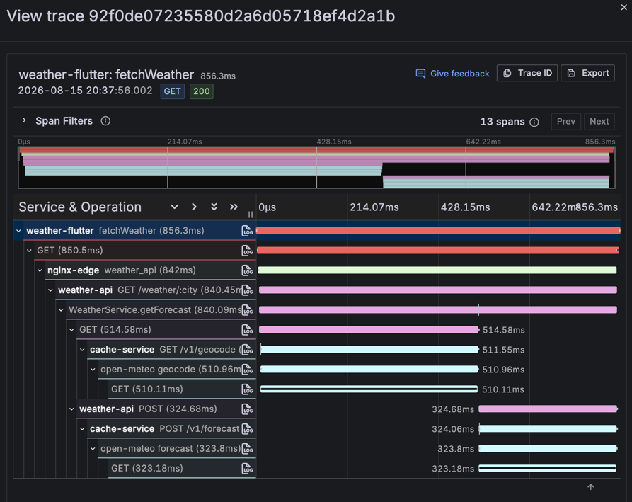
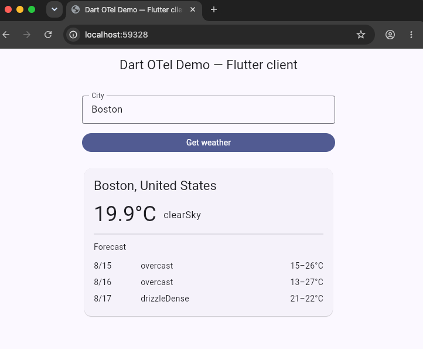
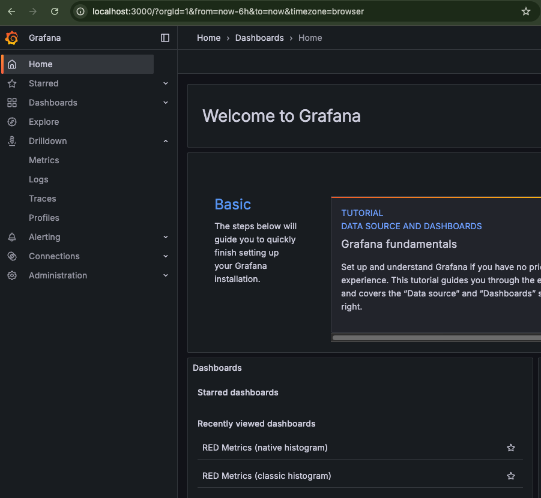
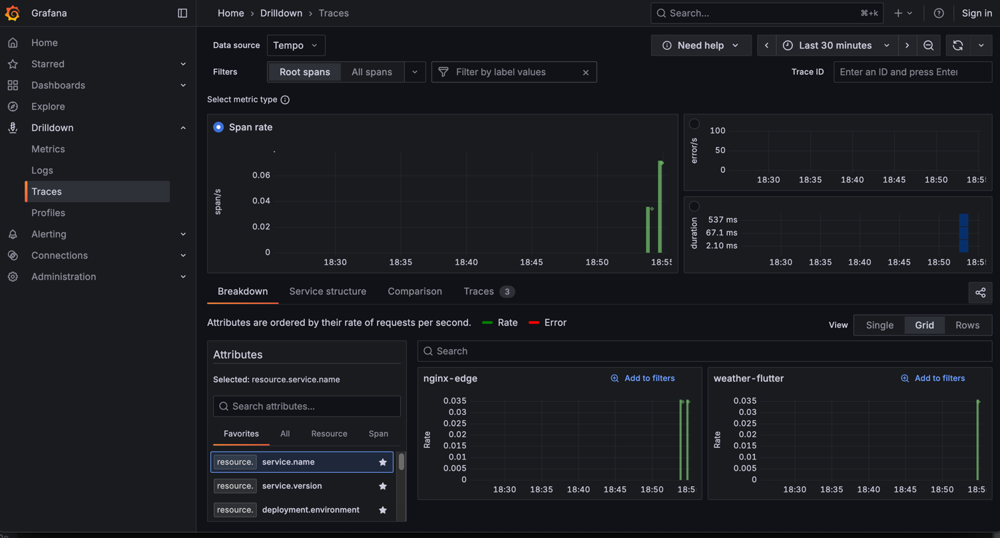
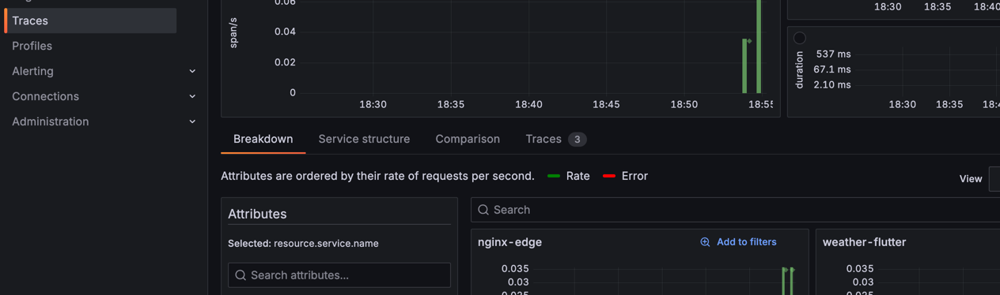
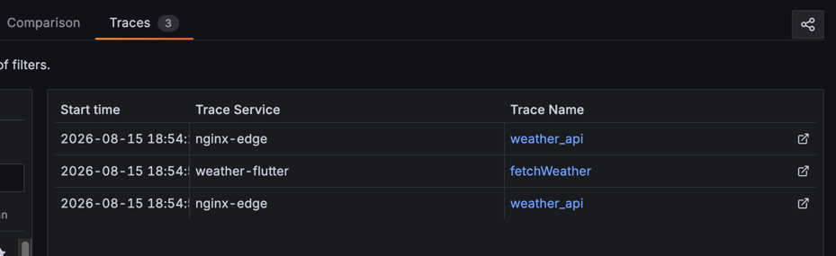
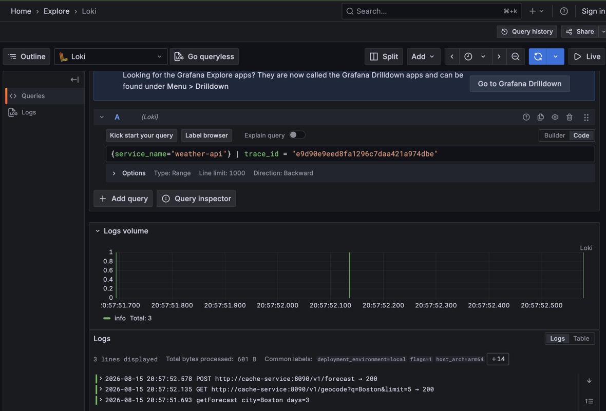
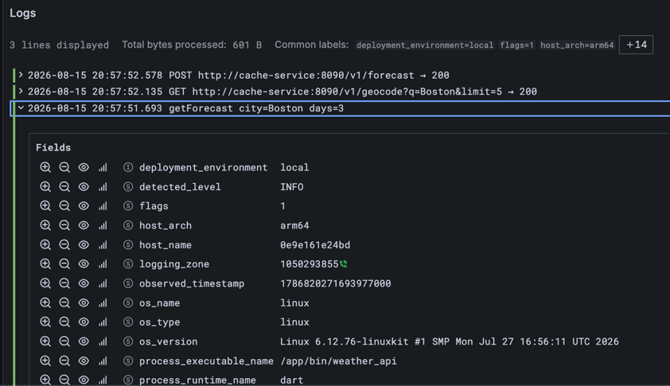

# Dart OTel Reference Demo




A reference implementation of the [`dartastic_opentelemetry`][sdk] SDK,
demonstrating well-instrumented:
- Dart server applications
- Dart CLIs
- Flutter apps
- Dart services on Cloud Run
- Dart Cloud Functions (Firebase Functions in Dart)

## Commercial Demo

[Dartastic.io](https://dartastic.io) offers an extended commercial version
of this demo and dozens of others, built on [Dartastic Native OTel](https://dartastic.io/otel),
with features including:
- Native error capture
- Janky widget identification
- Automatic personal information scrubbing
- Improved performance via the Dartastic Native OTel SDK
- [Dartastic Observatory](https://dartastic.io/observatory) o11y stacks specialized for Flutter and Dart
  - Dashboards utilizing attributes beyond the OpenTelemetry specification.
  - Demo with links that open the dashboard related to the demo.
- [Dartastic Symbolizer](https://dartastic.io/symbolizer) conversion of binary production errors into human-readable 
  source code lines.

To access the commercial demo, sign in to [Dartastic.io](https://dartastic.io) and use the
"Reference Demo" link at the top of your Dashboard.

## OpenTelemetry Primer

If this is your first contact with OpenTelemetry ("OTel"), read this section first.

**Just want to run the demo?** Jump to [Quick start](#quick-start).

The [OpenTelemetry.io docs](https://opentelemetry.io/docs/) are excellent and recommended reading.
However, they are very server-oriented.  Indeed Client Side Telemetry
is a newer and growing specification. This primer is focused on fullstack Dart and Flutter, from client to server
because `dartastic_opentelemetry` supports the full stack.

### The Problem OTel Solves

A single tap in a Flutter app can **trace** through a mobile client, 
an API server, multiple microservices, caches, databases, and third-party services. 
When it is slow, or fails, each of those processes writes its own logs, and nothing connects 
them. You end up guessing which log line in services B & D belong to the complaint about
the button click in client, A.  It's very difficult to answer "What problem did this mobile
user encounter?"

**The solution** is to give each request an identity (a trace id) that every process 
shares by passing it along, and to have each process record what it did under that
identity. That is the key to OpenTelemetry.

### OTel Concepts
**Signals** - There are three stable signals in OTel: **Traces**, **Metrics** and **Logs**. This demo emits all three. (A Profile Signal has an early alpha definition and beyond scope.)
  - **Traces** - The complete record of a single request or operation as it travels from a client through one more services.  
    They answer the question “what happened from the moment this work started until it finished?”
  - **Metrics** - Numerical measurements collected over time (counts, values, distributions).  
    They answer questions like “how many?”, “how much?”, or “how long on average?”
  - **Logs** - Timestamped records of discrete events with a level.  
    They answer the question “what exactly happened at this moment?”

**Context** 

Context is a bag of values that travels with the current execution. It primarily carries information about a Trace, 
but Logs and Metrics also read from it.    
Context is how the three Signals stay correlated.

  - **Context propagation** — How trace information crosses execution boundaries. The W3C defines
  the `traceparent` HTTP header to carry context information between processes communicating via HTTP. Context is also propagated in other ways. For example, from one Dart isolate to another or from a 
  Flutter Widget into JavaScript running inside it's child WebView. These are handled this transparently by `dartastic_opentelemety`.
  - **Baggage** — your own key/value pairs that ride along with the trace request. These are propagated by `dartastic_opetelemetry`'s BaggagePropagator.
  Baggage is not used often but useful for things every service should be able to see. Here are some common, practical baggage properties:
    
      | Key                   | Example value  | Why it’s useful                                         |
      |-----------------------|----------------|---------------------------------------------------------|
      | `user.role`           | `"admin"`      | Authorization / audit context                           |
      | `discount.pct`        | `"15"`         | Calculated value that later services need               |
      | `feature.flag.new_ui` | `"enabled"`    | Propagate A/B or feature-flag decisions                 |
      | `debug.verbose`       | `"true"`       | Force detailed logging for this request only            |
    
    - Keep baggage small: it is copied onto every downstream request. 
    - Baggage is not encrypted and is visible in headers, so only put data in baggage that you are happy to send to every downstream service.
    - The classic pattern is to set baggage on the API gateway (not from a Flutter app or web UI).

- **Attributes and Semantic Conventions** — attributes add detailed key/value information in telemetry.
  - Attributes are free-form, but OTel publishes Semantic Conventions - agreed upon names for hundreds of common attributes.
  - To ensure rock-solid OTel implementations, `dartastic_opetelemetry_api` defines Dart enums for
    every semantic convention, automatically generated from the OTel spec.
  - Examples:
    
    | Dart Enum               | Attribute name         | Description                      |
    |-------------------------|------------------------|----------------------------------|
    | `Http.httpMethod`       | 'http.method'          | HTTP request method              |
    | `User.userId`           | 'user.id'              | Identifier for an end user       |
    | `K8s.k8sClusterName`    | 'k8s.cluster.name'     | Name of a Kubernetes cluster     |
    | `Db.dbTable`            | 'db.collection.name'   | Name of a database table         |
    | `Geo.geoCountryIsoCode` | 'geo.country.iso_code' | ISO Country Code                 |
  
  - **AI understands the Semantic Conventions, making runtime analysis with AI very productive.**
  

- **Resource Attributes** are special attributes describing *what is emitting*, not what happened. The values are 
  computed once at initialization, then attached to everything.
  
  | Dart Enum                              | Attribute name                | Description                                      |
  |----------------------------------------|-------------------------------|--------------------------------------------------|
  | `Deployment.deploymentEnvironmentName` | `deployment.environment.name` | Deployment environment (production, staging…)    |
  | `Host.hostArch`                        | `host.arch`                   | CPU architecture of the host                     |
  | `Cloud.cloudRegion`                    | `cloud.region`                | Cloud region (e.g. `us-east-1`, `europe-west1`)  |
  | `Device.deviceId`                      | `device.id`                   | Unique identifier of the device                  |
  | `Device.deviceManufacturer`            | `device.manufacturer`         | Device manufacturer (Apple, Samsung, Google…)    |

  - Resources are collected automatically in `OTel.initialize()` but additional resources can be added to the set and passed
    into the call.  The example Flutter app shows how `device_info_plus` and `package_info_plus` are used to initialize with 
    important client resource attributes.
  - Resources allows OTel backend to show you that a certain kind of error happens on iOS but not Android, for example.

**Traces** 
  - **Trace** — all the work for one short-lived action or request, linked by a shared **trace id**. 
  - **Span** — one unit of work, always executing within a trace: an HTTP handler, a database call, 
    a route navigation, a tap or a swipe. The trace has a root span and a tree of child spans.  
    Spans are the primary object that developers interact with.
    Spans have:
    - A name.
    - A parent span (the parent of the root span is null).
    - A start and end time.
    - **Status** (Ok or Error). Caught exception should typically set the span's status to Error, making it easy to filter for errors.
    - Span attributes.
    - **Span Events**.

**Metrics**  

Metrics are numerical measurements aggregated over time.  
Unlike Traces (which follow one request) and Logs (which record discrete events), Metrics answer “how is the system behaving overall?”

Typical questions Metrics answer:
- How many requests per second is this endpoint receiving?
- What latency do 95% of the `POST /checkout` calls fall under? (the "p95 latency")
- How much memory is the Flutter app using right now?
- How many times did users tap the “Buy” button today?

Common metric instruments in OTel:
- **Counter** — a value that only goes up (e.g. total requests, total errors)
- **UpDownCounter** — a value that can go up or down (e.g. active connections, items in a cart)
- **Histogram** — a distribution of values (e.g. request duration, payload size)
- **Gauge** — the current value of something at a point in time (e.g. CPU usage, battery level)

Metrics can also carry attributes so you can slice them by `http.method`, `device.model.name`, etc.

Because Metrics live in Context, they can be correlated with the Trace that was active when the measurement was taken 
via **exemplars**.  Exemplars are samples of traces that occurred in the bucket of a histogram, or a value in a gauge 
or counter.  They enable clicking from a metric point to the traces that fell into that metric point.


**Logs** 

Logs are timestamped records of discrete events, usually with a severity level (trace, debug, info, warn, error, fatal).  

In traditional systems logs are just text. In OpenTelemetry they become first-class citizens:
- Every log record can automatically pick up the current **Trace ID** and **Span ID** from Context.
- You can jump from a Span in your observability UI straight to the exact log lines that were written while that Span was active.
- Log records also accept **attributes**, so you can attach structured data (`user.id`, `error.code`, `http.status_code`…) instead of stuffing everything into the message string.

This turns the classic “search through millions of log lines hoping to find the right ones” problem into a precise, 
one-click correlation between Traces, Metrics and Logs.

**Transport**
- **Exporters** — ship telemetry data out to an `OTel Collector`.  
  **OTLP** is the **O**pen**T**e**L**emetry's wire **P**rotocol. Because OTLP is a standard, changing
  backends is just a config change, not a rewrite. 
  - OTLP has two flavors: HTTP and gRPC, either can be compressed or uncompressed.
- **Sampling** Keeping every trace from a busy service or a large mobile fleet can be expensive with most 
   vendors, so it's typical to set a sampling rate to keep only a fraction. It's a tradeoff, the lower the 
   sampling rate, the higher the chance you will miss important information about a user's problem.
   [Dartastic Hosted Observatory](https://dartastic.io/observatory) allows greater sampling and more accurate
   troubleshooting by pricing observability backends by the size of the box, not the typical set of metrics 
   large observability vendors use price by the bytes of data transferred.


## How The Weather Demo Works

These demos run against any OTel backend. The instructions show how to run
a local observability stack in Docker using Grafana's `otel-lgtm` image:
Loki (logs), Grafana (dashboards/UI), Tempo (traces), and Prometheus
(metrics).

Some examples also run as Cloud Functions and on Cloud Run. See the
[Cloud Run README](./deploy/cloudrun/README.md) and
[Cloud Functions Gen 2 README](./deploy/functions/README.md), respectively. Both ship deployment scripts for
`weather-api` and `cache-service` with production-grade IAM-locked service-to-service auth, and recommend
Google Cloud Operations (Cloud Trace + Cloud Logging + Cloud Monitoring) as the telemetry backend.

For the design rationale and the choices behind these patterns, see
[DESIGN.md](./DESIGN.md); this README is the practical documentation of the
demos overall.

The demo is a small weather service with CLI and Flutter clients.

The Open-Meteo forecast API does not accept city names, it accepts coordinates. So two Open-Meteo web APIs are used:
- The Open-Meteo Geocoding API is used to look up the coordinates for "Boston", getting back its latitude and longitude.
- The Open-Meteo Weather API is used to look up the weather for the geo coordinates.

Both the geo and weather results are cached by the cache-service.

Answering "what is the weather in Boston?" takes multiple hops:

```text
weather_flutter/weather_cli ─▶ nginx ─▶ weather-api ─▶ cache-service ─▶ geocoding-api.open-meteo.com
                                              │                          "Boston" → 42.36, -71.06
                                              │
                                              └────────▶ cache-service ─▶ api.open-meteo.com
                                                                         42.36, -71.06 → 3-day forecast
```

Every arrow above is a span, and they all share one trace id, so the whole request arrives in the Grafana UI as a
single tree five levels deep.

1. The **client** (Flutter or the CLI) calls the server on port 8080.
2. **nginx** fronts the stack as the traced edge.  It is configured with the [ngx_otel_module](https://nginx.org/en/docs/ngx_otel_module.html), 
   so it starts the trace with an `nginx-edge` span and propagates the W3C `traceparent` header downstream — demonstrating 
   that OTel works across disparate systems: the trace begins in nginx (C) and continues through Dart services.  
3. The **weather-api** orchestrates the ``GET /weather/:city`` calls.  
4. The **cache-service** is called to get the coordinates of the city, `GET /v1/geocode`.  
   4a. If the coordinates are found in the cache, it returns them.  
   4b. If the coordinates are not found in the cache, the **cache-service** calls Open-Meteo's **Geocoding API** to get  
       the coordinates for the city.  The geocoding result is cached and returned to the weather-api.
5. The **weather-api** calls the **cache-service** again to get the weather for the coordinates `POST /v1/forecast`.  
   5a. If the weather result is found in the cache, it returns it.  
   5b. If the weather is not found in the cache, the **cache-service** calls Open-Meteo's **Forecast API** to get the    
       weather for the coordinates.  The weather result is cached and returned to the weather-api.
6. The **weather-api** returns the weather to the client, back through nginx.
7. The client displays the weather.

Browsers add one wrinkle: the Flutter web client is served from its own origin, so it makes two kinds of
cross-origin calls, each with its own CORS configuration:
- **Calling the API** — the weather-api sets permissive CORS headers itself (see `_corsMiddleware` in
  `services/weather_api/lib/src/router.dart`), including allowing the `traceparent`, `tracestate` and `baggage`
  headers so trace context propagation survives the browser's preflight.  nginx just passes these headers through.
- **Sending telemetry** — the OTel Collector's OTLP HTTP receiver has CORS configured in
  `deploy/local/otelcol-config.yaml` so the browser can POST spans to `:4318`.

## Quick Start

### 1. Start the stack.

```sh
tool/stack.sh up
```

This brings up the Docker compose file: `./deploy/local/docker-compose.yml`  
Be patient while it pulls images the first time.

This script brings up:
- The `nginx` edge with nginx OTel module
- Services
  - `weather-api`
  - `cache-service`
- The local `grafana-lgtm` observability stack in Docker.

Once started, leave it running to watch the stack stream the logs.
Run other commands in a second terminal window.

### **2. Run the Flutter client.** 

Same weather service, but the trace now starts from a tap in a Flutter app instead of the CLI.   
This uses Flutter Web and chrome for portability and ease.
```sh
cd apps/weather_flutter && flutter run -d chrome
```

When the client launches, click "Get weather"




### 3. Open Grafana and View The Traces

Open [local Grafana ↗](http://localhost:3000/) at `http://localhost:3000/`  in your browser.


Click on Traces. You should see one trace. If you don't see it right away, wait a minute or
two.  Try hitting the refresh button. 



Notice that the 

Click on Traces (#) Tab


You will see a table with three traces.


Click the weather-flutter trace link to see the full trace.


Click on the Log icon next to span.  


Expand the log lines to see the Resource Attributes for the span. 



### Having Trouble

If things are not working, you can test the `weather-api` with `curl`.

```sh
curl -s 'http://localhost:8080/weather/Boston?days=3' | jq .
```

Your request should return something similar to this:
```json
{
  "city": {
    "id": 4930956,
    "name": "Boston",
    "latitude": 42.35843,
    "longitude": -71.05977,
    "country": "United States",
    "countryCode": "US",
    "admin1": "Massachusetts",
    "timezone": "America/New_York",
    "population": 653833,
    "elevationMeters": 14.0
  },
  "current": {
    "observedAt": "2026-08-15T07:45:00.000",
    "temperatureCelsius": 17.8,
    ...
```


**3. Make some traffic.** One request makes one trace, which is a thin
dashboard. This fires 500 requests, 25 at a time, so there is enough data to
see patterns.

```sh
load/run_swarm.sh --total 500 --parallel 25
```


**5. Look at the telemetry.** Browse to <http://localhost:3000> and sign in
with `admin` / `admin`, then open **Dashboards → Dart OTel Demo → Service
Overview**. After step 3 the latency heatmap splits into two bands: the fast
one is requests answered from cache, the slow one is requests that had to
call Open-Meteo. To follow a single request instead, go to **Explore →
Tempo** and pick a trace.

Full walkthrough — what to look for in the trace tree, how to drive it from the CLI, how to tear it down 
is described in [deploy/local/README.md](./deploy/local/README.md).

## Package layout

Every package depends on the Dartastic OpenTelemetry **SDK**
(`dartastic_opentelemetry`). Library packages do not call `OTel.initialize()` —
that's exclusively an application-layer concern and lives in the service or
app entrypoint.

```
packages/
  weather_core         domain models, business logic, instrumented; no init
  weather_http_kit     shelf middleware + instrumented http.Client; no init
  weather_client       Dart HTTP client SDK for the v1 API; no init
  weather_otel         app-side bootstrap (init, SIGTERM wiring, gated admin endpoint)
services/
  weather_api          public front door
  cache_service        cache + upstream fetcher
apps/
  weather_cli          instrumented caller, swarmable
  weather_flutter      Flutter web/wasm client; trace originates in a user tap
  
load/
  run_swarm.sh         spawns N CLI instances for throughput demos
dashboards/
  grafana/             pre-built Grafana dashboard JSON, auto-loaded into the local stack
deploy/
  local/               docker-compose for app + Grafana LGTM
  cloudrun/            Cloud Run deploy scripts + env YAML; IAM-locked cache-service
  functions/           Cloud Functions Gen 2 deploy scripts + env YAML; same shape as cloudrun
```

## What's Contained in this Reference

The comprehensive list — every pattern, package, dashboard, and deployment
target you can read or copy from this repo.

### Distributed tracing end-to-end

- **Trace tree end-to-end.** `weather_cli → weather_api →
  cache_service → open-meteo`. Single trace_id, four levels deep.
  Provider-level spans (`open-meteo geocode`) nest as parents of
  transport-level client spans (`GET`) so each hop carries both
  business semantics and HTTP semantics.
- **W3C Trace Context propagation** on every HTTP boundary, inbound
  and outbound. Implemented once in `weather_http_kit` and reused.
- **W3C Baggage propagation** on every boundary too — `baggage`
  header extracted to `Context.current` so handler code can read it
  via `Baggage.fromContext(Context.current)`.
- **`BaggageSpanProcessor` wired by default in `weather_otel`'s
  bootstrap.** Every entry in `Context.current.baggage` is copied
  onto each starting span as a string attribute. Combined with the
  W3C Baggage propagator (which carries baggage entries as a
  `baggage` header on every outbound HTTP request), a baggage entry
  set once at the CLI's entry point appears as a span attribute on
  every span across the trace tree — `weather-cli`, `weather-api`,
  `cache-service`, and the open-meteo client spans nested under
  cache-service. Searchable in any backend without per-handler
  enrichment.
- **Concrete baggage entries** emitted by `weather_cli`:
  `cli.run_id` (UUID v4 per process invocation; finds all spans
  for one CLI run with one search) and `cli.session_id` (read
  from the `CLI_SESSION_ID` env var; the swarm script sets one
  session id for an entire batch so every CLI in one swarm
  shares it). Both are bounded-cardinality identifiers — safe
  for the BaggageSpanProcessor to copy onto every span.

### Production-grade SDK wiring

- **`BatchSpanProcessor`** in production paths.
  `SimpleSpanProcessor` only in tests. The bootstrap reads SDK
  defaults; explicit overrides are an `OTEL_*` env-var concern.
- **`ParentBasedSampler(TraceIdRatioSampler(...))`** wired in the
  bootstrap. 100% sampling default for the demo, env-overridable.
- **SIGTERM / SIGINT graceful shutdown.**
  `weather_otel.attachToProcessLifecycle()` installs handlers that
  forceFlush and shutdown the SDK before exit. Documented for the
  Cloud Run 10-second grace window.
- **try/catch/finally** using `recordException` + `setStatus(Error)`
  on every caught exception and showing span status only needs to
  be set on errors.
- **Zone-based uncaught-error capture.** Every Dart entry point
  (`weather_cli`, `weather_api`, `cache_service`) wraps its `main`
  in `runWithOtelErrorHandlers` (from `weather_otel`), which
  installs a `runZonedGuarded` handler that records the exception
  on the active span and logs it through `package:logging` — the
  OTel-bridged log pipeline picks it up automatically. The Flutter
  client uses the full three-handler pattern: `runZonedGuarded` +
  `FlutterError.onError` + `PlatformDispatcher.instance.onError`,
  each one feeding the same `_recordOnSpan` helper so framework,
  platform, and async-escape errors are all visible in the
  backend.
- **Error categorization across HTTP boundaries.**
  `WeatherProviderException` ↔ HTTP status mapping is symmetric
  between weather_api (`httpStatusForProviderError`) and
  weather_client (`_exceptionForStatus`); errors round-trip cleanly
  through any number of hops.

### HTTP semconv metrics

- **`http.server.request.duration` histogram** emitted by the shelf
  middleware with a deliberately low-cardinality label set
  (method, route TEMPLATE, status_code, scheme), pinned by a test
  that catches accidental high-cardinality additions. The metric
  name, instrument kind, and unit come from spec-derived `HttpMetric` 
  enum so typos in any of the three are compile errors:

  ```dart
  const httpServerDuration = HttpMetric.httpServerRequestDuration;
  meter.createHistogram<double>(
    name: httpServerDuration.name,   // 'http.server.request.duration'
    unit: httpServerDuration.unit,   // 's'
    description: '…',
  );
  ```

  Attribute maps are built with the typed-enum + dot-shorthand
  pattern:

  ```dart
  OTel.attributesFromSemanticMap({
    ...<Http, Object>{
      .httpRequestMethod:      request.method,
      .httpRoute:          route ?? 'unknown',
      .httpResponseStatusCode: statusCode,
    },
    Url.urlScheme: request.requestedUri.scheme,
  });
  ```

  Inner `<Http, Object>` and `<Url, Object>` spreads carry the
  enum-prefix as the map's static type, which is what makes the
  `.httpRequestMethod` shorthand resolve. Different enum families mix
  in the same outer literal. For a single-family map, prefer
  `OTel.attributesOf<Http>({.httpResponseStatusCode: 200, ...})` —
  same shorthand, no spread.
- **In-flight requests gauge** (`http.server.active_requests`) in
  `weather_http_kit`'s shelf middleware. UpDownCounter
  incremented on request start, decremented on request end (in
  `finally`, so handlers that throw still decrement). Same
  bounded label set as the duration histogram minus
  `http.response.status_code` (the request is in flight, no
  status yet) — `http.request.method`, `http.route`,
  `url.scheme` only. Pinned by a cardinality test plus a
  return-to-baseline test that catches inc/dec attribute
  mismatches before they leak series in production.

### Domain metrics

- **Cache attribution on spans.** `cache_service` annotates the
  active server span with `weather.cache.namespace`,
  `weather.cache.outcome` (hit / miss / expired), and
  `weather.cache.size`, plus a `cache.{outcome}` event.
- **Cache hit/miss/expired counter** in `cache_service`.
  `weather.cache.lookups` is a counter incremented per cache
  lookup, attributed by `weather.cache.namespace` (forecast |
  geocode) and `weather.cache.outcome` (hit | miss | expired).
  Cardinality is bounded forever — eight series at most. Promoted
  from a span attribute (which is per-trace and only useful for
  individual debugging) to a proper metric so backends can chart
  hit ratio over time and alert on miss-rate spikes. The
  cardinality discipline is pinned by a test in
  `services/cache_service/test/handler_test.dart` —
  introducing a high-cardinality attribute on this metric (a
  query string, a request id) makes the test fail.
- **Upstream dependency-health + cost counter**
  (`weather.upstream.requests`) on `OpenMeteoProvider`. One
  counter answers two questions: dependency health (success /
  total over a rolling window, sliced by `error.kind`) and
  upstream-call cost (count × per-call price). Attributes:
  `weather.provider`, `weather.operation`, `weather.outcome`,
  `weather.error.kind` (only when outcome=error). ~80 series
  upper bound. Cardinality is pinned by a test that fails the
  moment a high-cardinality attribute (city name, query string,
  request id) is added.

### FaaS / Cloud Functions support

- **`faas.coldstart` and `faas.invocation_id` per-invocation
  attributes** on every server span emitted by `weather_http_kit`'s
  `otelMiddleware`. `faas.coldstart` is a boolean — `true` on the
  first request a process handles, `false` thereafter — set via a
  process-global latch that flips on first observation.
  `faas.invocation_id` is read from the `Function-Execution-Id`
  inbound header (Cloud Functions Gen 2 sets this on every
  invocation) and forwarded as-is so trace data correlates with
  the platform's own logs and metrics. Both are span attributes
  only, never metric labels (the execution id is high-cardinality
  by design).
- **`weather.coldstart_request.duration` histogram** alongside the
  `http.server.request.duration` histogram, recorded once per
  process — on the first request the instance handles. Same
  low-cardinality label set as the duration histogram (method,
  route, status_code, scheme) so dashboards can graph cold-start
  cost distribution side-by-side with the general-purpose latency
  distribution without folding `faas.coldstart` in as a label
  (which would double the duration histogram's series count for
  warm-path values that are always `false`). Named in the demo's
  custom `weather.*` namespace rather than `faas.*` because the
  OTel spec's `faas.init_duration` measures pure init time before
  user code runs, which is a different signal than total
  first-request latency.

### Logs

- **OTel logs SDK integration via a `package:logging` bridge.**
  `weather_otel`'s bootstrap forwards every `package:logging`
  record through the OTel logs SDK so entries flow over OTLP
  with the active span's trace_id and span_id attached, while
  the application's own stdout listener keeps printing locally
  (additive, not a replacement). Each `Logger` becomes its own
  OTel instrumentation scope by name. The bridge is the published
  [`otel_logging`](https://pub.dev/packages/otel_logging) package —
  `PackageLoggingBridge.install()` at startup, `uninstall()` before
  SDK shutdown — so any app can drop in the same one-liner.

### Backend selection

- **Backend selection by env var, no code change.** The
  Dartastic SDK reads the standard `OTEL_TRACES_EXPORTER`
  (`otlp` | `console` | `none`) and `OTEL_EXPORTER_OTLP_ENDPOINT`
  variables on its own — the bootstrap doesn't add any custom
  switching. Five concrete backends documented today: Grafana
  LGTM (local stack), `console` / stdout (debugging and CI),
  Google Cloud Operations (Cloud Run target — Cloud Trace +
  Cloud Logging + Cloud Monitoring), Dartastic Cloud (when
  online), and any other OTLP-compatible backend (Honeycomb, a
  self-hosted collector, …). See
  [Selecting a telemetry backend](#selecting-a-telemetry-backend)
  below.

### Local development

- **Local stack** (`deploy/local/`): `docker compose` brings up
  `weather_api` + `cache_service` + Grafana LGTM + bundled
  dashboards in one command. Single-binary stack with auto-loaded
  dashboards under "Dart OTel Demo" in Grafana.
- **Swarm script** (`load/run_swarm.sh`): N parallel CLI
  invocations, post-run flush via the demo admin endpoints
  (`POST /flush` on loopback-bound 8081 / 8091, only when
  `WEATHER_DEMO_MODE=true`).
- **Bundled Grafana dashboard** in `dashboards/grafana/`,
  auto-loaded into the local stack's Grafana container.

### Browser support (Flutter web + wasm)

- **Flutter web/wasm client** (`apps/weather_flutter`). The simplest
  possible Flutter screen — text field for the city, button to
  fetch, card showing current conditions and a 3-day forecast.
  Wires the Dartastic OpenTelemetry SDK directly: explicit OTLP
  HTTP exporters for traces, metrics, and logs (JSON wire format
  in debug builds, protobuf in release builds — selected via
  `kDebugMode`); a manually-started root span around the user's
  tap; and `InstrumentedHttpClient` for trace-context propagation
  on every outbound request. Demonstrates that SDK 1.1.0-beta.12 + API
  1.0.0-rc.1 work in dart2js AND dart2wasm — five-level trace
  tree from the tap through to Open-Meteo, with payloads readable
  in DevTools. **Sub-millisecond span timing** on web comes for
  free: the API's `WebTimeProvider` is selected at compile time
  via `dart.library.js_interop` and routes timestamps through
  `performance.now() + timeOrigin` instead of `Date.now()`'s
  millisecond floor — no opt-in needed. **Flutterrific
  OpenTelemetry Pro** (coming as a Dartastic.io Pro package)
  will replace the manual SDK wiring with navigator-observer
  spans, route-template extraction, error-boundary widgets, and
  frame-timing metrics; the demo uses the SDK directly so
  readers see the mechanics.
- **Permissive CORS on `weather_api`.** A small middleware
  (`_corsMiddleware` in `services/weather_api/lib/src/router.dart`)
  allows the browser to send the `traceparent`, `tracestate`, and
  `baggage` headers the W3C propagators need. Production code
  should narrow `access-control-allow-origin` to a specific origin;
  the demo uses `*` for reference simplicity.
- **Web-safe `weather_client`.** The package is conditionally-
  imported web-safe — `dart:io`'s `SocketException` is split via a
  stub for browser builds (`packages/weather_client/lib/src/_compat/`)
  so the client SDK builds for both io and web targets unchanged.

### Production deployment

- **Cloud Run deployment** (`deploy/cloudrun/`).
  `weather-api` and `cache-service` deploy via the bundled
  `gcloud-deploy-*.sh` scripts. Production-grade auth:
  `cache-service` is `--no-allow-unauthenticated`; weather-api's
  outbound HTTP path attaches a Cloud Run ID token from the GCE
  metadata server (no-op locally, active on Cloud Run) on every
  call. Telemetry destination is OTLP-to-Cloud-Operations by
  default — Cloud Trace / Cloud Logging / Cloud Monitoring all
  accept OTLP natively.
- **Cloud Functions Gen 2 deployment** (`deploy/functions/`).
  Mirror layout to `deploy/cloudrun/`. Same Dockerfiles, same
  `WeatherClient.tokenProvider` wiring (Functions Gen 2 IS Cloud
  Run under the hood — `K_SERVICE` is set, the metadata server is
  reachable, SIGTERM is delivered the same way), with overrides in
  the env YAML for `cloud.platform=gcp_cloud_functions` and
  `faas.name` so dashboards can split Functions out from Cloud
  Run.

### Testing pattern

- **Testing pattern** with `InMemorySpanExporter` and an
  on-demand metric reader. Every package has a ~50-line harness
  designed to be lifted into a reader's project unchanged. See
  [Testing strategy](#testing-strategy) for the full pattern.

## Deployment matrix

The same Dart code ships to three runtimes. The runtime is selected by a
Dockerfile or a Functions entry shim. The telemetry destination is selected
entirely by `OTEL_*` environment variables — there is **no code change
between backends.**

| Runtime                         | weather_api | cache_service | Notes                              |
|---------------------------------|-------------|---------------|------------------------------------|
| Local Docker Compose            | container   | container     | Bundled with Grafana LGTM stack    |
| Google Cloud Run                | service     | service       | Service-to-service via internal URL|
| Dart Cloud Functions (Gen 2)    | function    | function      | Function-to-function via HTTPS     |

## System architecture

The request path from [Distributed Tracing CLI Demo](#distributed-tracing-cli-demo),
drawn as the deployment stack — who calls whom, and what rides on each hop:

```
                ┌──────────────────────────────────────┐
                │  external — open-meteo.com           │
                │  geocoding-api → coordinates         │
                │  api           → forecast            │
                └──────────────▲───────────────────────┘
                               │ http (W3C trace context)
                ┌──────────────┴───────────────────────┐
                │  cache_service                       │
                │  in-memory cache; on miss, fetches   │
                │  upstream and writes back            │
                └──────────────▲───────────────────────┘
                               │ http (W3C + baggage)
                ┌──────────────┴───────────────────────┐
                │  weather_api                         │
                │  public front door: validation,      │
                │  request shaping, response format    │
                └──────────────▲───────────────────────┘
                               │ http (W3C + baggage)
                ┌──────────────┴───────────────────────┐
                │  weather_cli   (instances 1..N,      │
                │                 swarmable)           │
                │  or apps/weather_flutter in a browser│
                └──────────────────────────────────────┘
```

Two things travel on those arrows, and they are different:

- **Trace context** is what stitches the spans together. Each service passes
  the `traceparent` header along, so the CLI, both services and the
  Open-Meteo calls all report into one trace instead of four unrelated ones.
- **Baggage** is your own key/value data riding beside it. The CLI sets
  `cli.run_id` and `cli.session_id`, and a `BaggageSpanProcessor` copies them
  onto every span downstream — so you can search for one swarm run across
  services without threading a parameter through every function.

Both are W3C standards, not Dartastic inventions, which is why the same
headers work against any OTel backend.

[OpenTelemetry Usage in the Demo](#opentelemetry-usage-in-the-demo) above
says how each of these is implemented and where to copy it from.

## Local development workflow

```sh
# Run the same checks CI runs (pub get, analyze, format, test):
tool/build.sh

# Same plus AOT-compile every services/<name>/bin/server.dart:
tool/build.sh --release

# Run a service locally in the foreground.
# With one service available, no argument needed:
tool/run.sh

# With multiple services, pick one:
tool/run.sh weather_api
tool/run.sh --list

# Generate a unified LCOV coverage report at coverage/lcov.info:
tool/coverage.sh

# Or with an HTML report at coverage/html/ (requires lcov's `genhtml`):
tool/coverage.sh --html
```

`tool/run.sh` forwards the standard `OTEL_*` environment variables and
each service's own config (`PORT`, `ADMIN_PORT`, `WEATHER_DEMO_MODE`) from
the calling shell — see each service's README for the accepted set.
For the canonical local-stack invocation:

```sh
OTEL_EXPORTER_OTLP_ENDPOINT=http://localhost:4317 \
OTEL_EXPORTER_OTLP_PROTOCOL=grpc \
tool/run.sh weather_api
```

## Selecting a telemetry backend

Backend selection is purely env-var driven — **no code change between
backends.** The Dartastic SDK reads the standard `OTEL_*_EXPORTER`
variables and dispatches to the appropriate exporter at startup.

| Backend                     | `OTEL_TRACES_EXPORTER` | Endpoint env var                            |
| --------------------------- | ---------------------- | ------------------------------------------- |
| Grafana LGTM (local)        | `otlp` (default)       | `OTEL_EXPORTER_OTLP_ENDPOINT=http://localhost:4317` |
| stdout / debugging          | `console`              | (none — writes to the process's stdout)     |
| Disabled (CI, fast tests)   | `none`                 | (none — no spans exported)                  |
| Google Cloud Operations     | `otlp` (default)       | `OTEL_EXPORTER_OTLP_ENDPOINT=https://telemetry.googleapis.com:443` |
| Any other OTLP backend      | `otlp` (default)       | `OTEL_EXPORTER_OTLP_ENDPOINT=https://your-backend.example` |

For example, to print every span to stdout (handy when iterating on
instrumentation without bringing up the full stack):

```sh
OTEL_TRACES_EXPORTER=console \
OTEL_METRICS_EXPORTER=none \
OTEL_LOGS_EXPORTER=none \
tool/run.sh weather_api
```

Cloud Run and Cloud Functions deployments use exactly the same
mechanism — see [`deploy/cloudrun/README.md`](./deploy/cloudrun/README.md#telemetry-destination)
for the Cloud Operations + Dartastic Cloud + bring-your-own-OTLP
walkthrough.

## Testing strategy

Tests in this repository do not mock the OpenTelemetry SDK. Instead they
bring up the **real** SDK pointed at an **in-memory span exporter** that
captures every emitted span for inspection. This is a deliberate teaching
choice and one of the patterns we most want readers to copy.

### Why not mock OpenTelemetry

Mocking instrumentation gives false confidence. A test that asserts
`mockTracer.startSpan(...)` was called proves only that the *test code* was
written to call it — it tells you nothing about whether the resulting span
has the right name, the right kind, the right attributes, the right status,
the right parent, or the right baggage. Worse, the mock has to be kept in
sync with the SDK's evolving API surface, and any divergence makes the
tests pass while production breaks.

Pointing the real SDK at an in-memory exporter inverts the cost:

- The SDK's behavior is exercised end-to-end. If it changes meaningfully,
  tests notice.
- Assertions are about the **observable telemetry** — the spans, their
  attributes, the events on them, the resulting status. That is what a
  real backend will see, and what an SRE will debug from.
- The in-memory exporter is ~50 lines of code. Reproduced verbatim in
  every demo test directory; reusable in any reader's project.

### The pattern

```dart
// test/_helpers/otel_test_harness.dart
class InMemorySpanExporter implements SpanExporter {
  final List<Span> _spans = <Span>[];
  List<Span> get spans => List.unmodifiable(_spans);
  void clear() => _spans.clear();
  Span? findSpanByName(String name) { /* … */ }

  @override
  Future<void> export(List<Span> spans) async => _spans.addAll(spans);
  @override Future<void> forceFlush() async {}
  @override Future<void> shutdown() async {}
}

Future<InMemorySpanExporter> maybeInitializeOtelForTest() async {
  final exporter = InMemorySpanExporter();
  await OTel.initialize(
    serviceName: 'test',
    serviceVersion: '0.0.0-test',
    spanProcessor: SimpleSpanProcessor(exporter),
  );
  return exporter;
}
```

A test then does:

```dart
late InMemorySpanExporter spans;
setUpAll(() async => spans = await maybeInitializeOtelForTest());
setUp(() => spans.clear());

test('records the right span on geocode', () async {
  await provider.geocode('Boston');
  final span = spans.findSpanByName('open-meteo geocode');
  expect(span, isNotNull);
  expect(span!.kind, SpanKind.client);
});
```

`SimpleSpanProcessor` in tests is the **only** place this codebase uses it
— production paths use `BatchSpanProcessor` exclusively. Tests need
synchronous export-per-span so spans are available immediately after the
system under test returns; production prioritizes throughput over latency.

### Fakes, not mocking frameworks

Where the tests need test doubles for non-OTel collaborators (the
`WeatherProvider` in `WeatherService` tests, the `http.Client` in provider
tests), we hand-roll small `FakeXxx` classes or use the http package's
built-in `MockClient`. We do not pull in `mockito`, `mocktail`, or other
mocking frameworks. A hand-written 30-line fake is more readable for a
blog audience than four lines of `when(...).thenReturn(...)` magic. Real
projects can choose differently.

### Coverage

`tool/coverage.sh` at the repository root runs the test suite for every
package in the workspace, formats the result as a unified LCOV report at
`coverage/lcov.info`, and (with `--html`) renders an HTML report at
`coverage/html/`. CI integration is straightforward.

## Demo affordances

These are demo-time conveniences. They never run in a production deployment.

- **Admin `POST /flush` endpoint** on a loopback-bound port (8081 for
  weather_api, 8091 for cache_service), exposed by
  `weather_otel.demoAdminPipeline()` only when `WEATHER_DEMO_MODE=true`.
  The bootstrap helper short-circuits when the flag is unset —
  production binaries do not exercise the code path. Driven by `curl`
  from the swarm script, or directly by the user.
- **`load/run_swarm.sh`** spawns N CLI instances in parallel for
  throughput demonstrations and POSTs to both flush endpoints at the
  end of every batch so traces land in the backend immediately.
- **Pre-built Grafana dashboard JSON** in `dashboards/grafana/`,
  auto-loaded into the local stack's Grafana container.

## Error handling (planned)

[ERROR_HANDLING.md](ERROR_HANDLING.md) is the implementation brief for
demonstrating the OTel error-handling contract (`OTel.setErrorHandler`,
strict mode, isolate propagation) — gated on the next
`dartastic_opentelemetry_api` / SDK releases.

## Quick links

- [DESIGN.md](./DESIGN.md) — architectural rationale and design decisions
- [Dartastic OpenTelemetry SDK][sdk]
- [Flutterrific OpenTelemetry][flutterrific] — the Flutter-side companion
- [Open-Meteo](https://open-meteo.com) — upstream weather API (free, no key)
- [Dartastic.io](https://dartastic.io) — Pro packages and hosted backend

## License

Apache-2.0. See [LICENSE](./LICENSE).

[sdk]: https://github.com/MindfulSoftwareLLC/dartastic_opentelemetry
[flutterrific]: https://github.com/MindfulSoftwareLLC/flutterrific_opentelemetry
